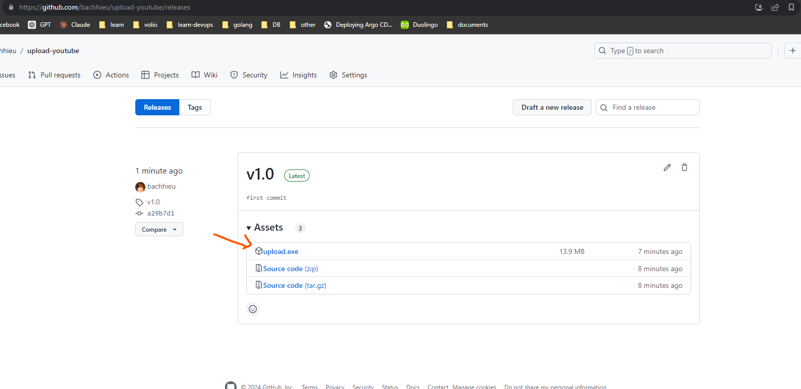
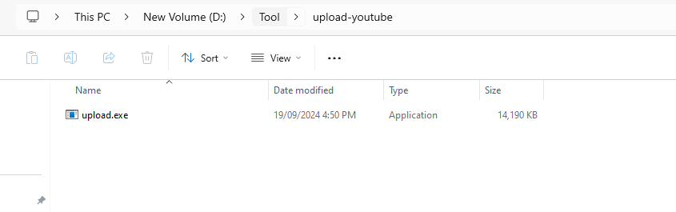
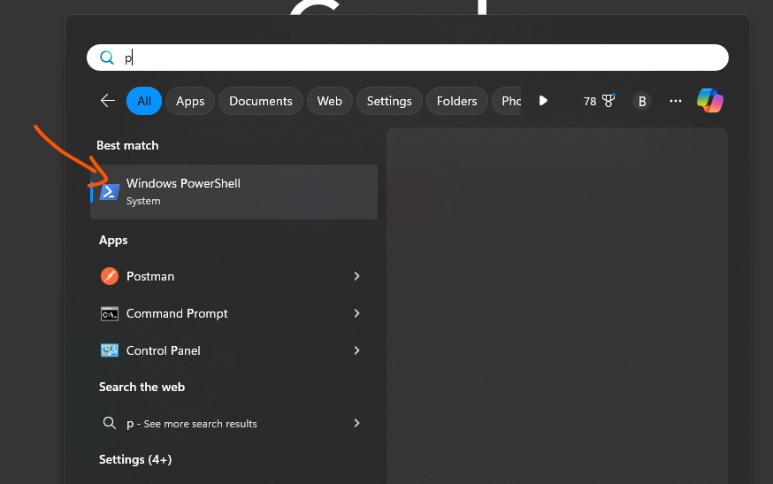
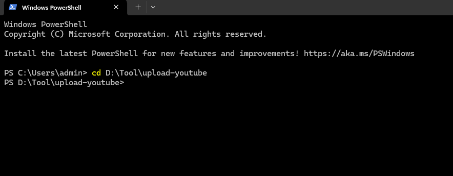
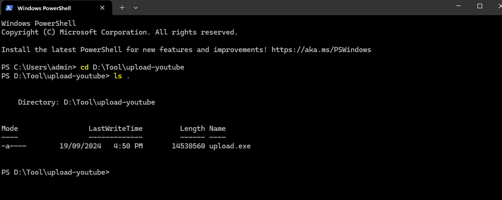

# Hướng dẫn sử dụng:

## Bước 1: Truy cập [https://github.com/bachhieu/upload-youtube/releases](https://github.com/bachhieu/upload-youtube/releases) và tải file upload.exe vào thư mục bất kỳ




## Bước 2: Tiến hành mở `Windows PowerShell` và di chuyển tới thư mục chứa file đã tải




Mở `Windows PowerShell`



Di chuyển đến thư mục chưa file đã tải : Ví dụ file được chưa trong thư mục `D:\Tool\upload-youtube` => `cd D:\Tool\upload-youtube` => `Enter`



Để kiểm tra xem đã vào đúng thư mục chưa có thể sử dụng lệnh : `ls .` để kiểm tra file đã có trong thư mục hay chưa




## Tiến hành thực hiện chạy upload tự động

### Ví dụ muốn tải lên video ở thư mục `\\voliowp\jacatgames\video` lên kênh `volio group` với channel id của kênh là `UCFZFCpjDczOHAaAX1SFrZABA` và trong playlist là `abc`

```ps
.\upload.exe --channel=UCFZFCpjDczObAaAX1SFrZNA --playlist=abc --path=\\voliowp\jacatgames\video
```
**Trong đó:**
  - channel: là ID của channel muốn upload
  - path : Là thư mục chưa video hoặc đường dẫn cụ thể đến video - Hỗ trợ 4 định dạng `.mp4/.avi/.mkv/.mov"`
  - playlist: Là danh sách phát muốn được gán cho video sau khi upload


**Lưu ý:**
  - Để có thể upload được video thì bạn cần login youtube trước khi có thể upload